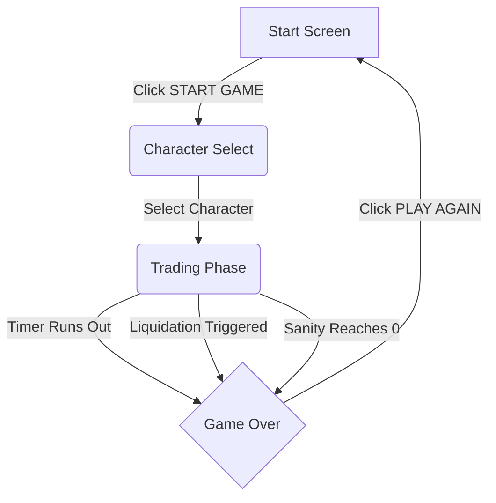

# Consolidated Game Design & Technical Document: Stop Being Poor

**Last Updated:** 2025-06-25

---

## PART 1: Project & Product Vision

### 1.1. Introduction

*   **Game Title:** Stop Being Poor
*   **Concept:** A fast-paced, high-stakes trading simulation game with emotional feedback mechanics, challenging players to manage risk and emotion under pressure within a retro, cyberpunk-inspired pixel art aesthetic.
*   **Genre:** Simulation, Arcade Trading
*   **Target Audience:** Casual gamers interested in trading concepts, players enjoying high-risk/reward mechanics, fans of retro aesthetics, students, and individuals interested in learning about stock trading.
*   **Theme:** A high-energy, neon-drenched, and slightly stressful trading environment. The visual theme combines retro pixel art with cyberpunk elements, utilizing a palette of neon green, red, and black.

### 1.2. Vision & Goals

*   **Product Vision:** To be the leading platform for accessible and engaging stock trading simulation, presented with a distinctive retro pixel art aesthetic.
*   **Project Goals:** To create a web-based trading simulation game that allows users to practice stock trading strategies in a risk-free environment.
*   **Success Metrics:** Number of active users, user engagement time, accuracy of trading simulations.

### 1.3. Problem Statement & Scope

*   **Problem:** Users need a platform to practice stock trading strategies in a risk-free, engaging environment.
*   **In Scope:**
    *   Access code verification for game entry (Supabase Edge Functions).
    *   Character selection with unique gameplay modifiers (Sanity drain).
    *   Simulated buying and selling of a single asset.
    *   Display of a procedurally generated, dynamic stock chart.
    *   Real-time PNL, wallet, and liquidation price tracking.
    *   An emotional feedback system including Sanity, Heart Rate, and a dynamic Emotion emoji.
*   **Out of Scope:**
    *   User registration and login.
    *   Real-money trading.
    *   Integration with external financial APIs for live data.
    *   Advanced trading features (e.g., options, futures).
    *   Multiplayer features.

---

## PART 2: Game Design

### 2.1. Core Gameplay Loop & Flow

The game progresses through distinct phases, guided by user interaction and game events.



1.  **Start Screen:** Player initiates the game.
2.  **Character Selection:** Player chooses one of three trader personas (Stoic, Nervous Newbie, Full Degen), which influences gameplay elements like Sanity drain.
3.  **Trading Phase:** Player actively manages trades within a **90-second** time limit.
4.  **Game Over:** The game ends when the timer expires, the player is liquidated, or their sanity reaches zero. Final results and a trade history are displayed.
5.  **Restart:** Player can choose to play again, returning to the Start Screen with a fresh $10,000 wallet.

### 2.2. Core Mechanics

*   **Trading:** Players can open a single BUY/LONG or SELL/SHORT position at a time by clicking the respective buttons. The `entryPrice` is recorded at the exact market price when the position is opened.
*   **Leverage:** A multiplier ranging from 1x to 1000x is selected using a slider *before* opening a position. Leverage amplifies both potential profits and losses. The selected leverage is locked and cannot be adjusted while a position is open.
*   **Position Size & Margin:** The entire current `walletBalance` is automatically allocated and used as the `initialMargin` for the trade when a position is opened.
*   **PNL (Profit and Loss):** Calculated and displayed in real-time. The calculation is based on the point difference between the `currentPrice` and the `entryPrice`, scaled by a fixed value per point **($5)**, and then multiplied by the selected `leverage`. The real-time `PNL` directly affects the displayed `walletBalance`.
    *   *Formula (LONG):* `PNL = (Current Price - Entry Price) * $5 * Leverage`
    *   *Formula (SHORT):* `PNL = -(Current Price - Entry Price) * $5 * Leverage`
*   **Wallet & Liquidation:** Starts at an initial value of $10,000. Liquidation is triggered automatically when the negative `PNL` of an open position becomes equal to or exceeds the `initialMargin`. Upon liquidation, the position is forcibly closed, the player loses the entire `initialMargin`, the `walletBalance` is set to $0, and the game ends immediately. A `liquidationPrice` is calculated and displayed when a position is opened.
*   **Game Timer:** The trading phase has a fixed duration of **90 seconds**. When the timer reaches zero, any open position is automatically closed at the current market price.
*   **Controls:**
    *   **Buttons:** For initiating game flow ("START GAME", "PLAY AGAIN"), character selection, and executing trading actions ("BUY/LONG", "SELL/SHORT", "CLOSE"). Trading action buttons have disabled states based on the current game state.
    *   **Slider:** Used to adjust the `leverage` multiplier. It is disabled while a position is open.
    *   **Chart Interaction:** Includes mouse wheel functionality for scrolling, mouse drag for panning, and dedicated buttons for zooming and navigation.

### 2.3. Emotional Feedback System (Trader Status)

This system provides dynamic feedback to the player based on their actions and performance.

*   **Sanity Meter:**
    *   **Purpose:** A visual meter (represented as 8 segments) indicating the trader's mental state/risk tolerance. Reaching 0 sanity triggers an immediate game over.
    *   **Initial Value:** 8.
    *   **Decrease Logic:**
        *   Opening Position: -1 (Stoic), -1.5 (Nervous Newbie), -2 (Full Degen).
        *   Negative PNL (Real-time): -0.1 (Stressed: PNL < -20% margin), -0.2 (Panicked: PNL < -50% margin).
        *   High Leverage + PNL Swing: -0.3 if `leverage > 10` AND `abs(PNL %) > 5%`.
        *   Closing Losing Position: -0.5.
        *   Liquidation: -1.5.
    *   **Increase Logic:** None. Sanity only decreases and does not regenerate.
*   **Heart Rate (BPM):**
    *   **Purpose:** A visual indicator reflecting the trader's stress and excitement levels, displayed with an animated ECG line whose speed dynamically changes with the BPM value.
    *   **Calculation:** Calculated based on a base rate (75 BPM), the absolute PNL percentage relative to margin, the selected leverage, and whether a position is open. Clamped between 60-200 BPM.
*   **Emotion:**
    *   **Purpose:** Visual feedback via a dynamic emoji reflecting the current state.
    *   **States:** Neutral, Happy, Stressed, Panicked, Excited, Euphoric, Insane.
    *   **Triggers:** Determined by PNL percentage relative to margin and high leverage/PNL swing conditions.

---

## PART 3: User Experience & Interface

### 3.1. UX Goals & Principles

*   **Overall:** Intuitive, engaging, informative, and visually distinctive with a consistent pixel art theme.
*   **Principles:** Clarity, Efficiency, Consistency, Engagement, Accessibility.

### 3.2. Visuals, Art & Audio

*   **Visual Style:** Consistent retro pixel art style applied throughout the UI. Neon green (`#00ff00`) serves as the primary accent color against black backgrounds. Red (`#ff3333`) is used to indicate negative PNL, short positions, and warnings.
*   **Fonts:** 'Press Start 2P' and 'VT323' Google Fonts are used for all text to maintain the bitmap aesthetic.
*   **UI Elements:** Buttons, containers, and other elements feature a distinct "pixelated" border style.
*   **Animations:**
    *   **UI Feedback:** Screen flashes for profit (green) and loss (red), a more intense screen shake and "LIQUIDATED!" text overlay on liquidation. A purple flash and "You f**king gambler." text appears on a sanity-based game over.
    *   **Trader Status:** Animated ECG line for Heart Rate, pulsing and glowing heart icon, and dynamic changes (pulse, shake) for the trader emotion emoji.
*   **Audio (Suggestions):**
    *   **UI Sounds:** Distinct sound effects for button clicks and slider adjustments.
    *   **Game Events:** Specific audio cues for opening/closing trades (profitable vs. losing), a dramatic sound on liquidation, and a timer tick-tock.
    *   **Ambiance:** A low, retro electronic background music loop.

### 3.3. UI Screens & Components

*   **`GameViewportScaler`:** Ensures the entire game interface scales to fit the player's browser window, and includes the fullscreen toggle button.
*   **Start Screen:** Minimalist screen with game logo, title, and "START GAME" button against an animated GIF background.
*   **`AccessCodeVerification` Screen:** A modal-like screen with an input field and "Verify Code" button. Displays success or error messages.
*   **`CharacterSelect` Screen:** Presents the three trader personas with their images in a grid. Clicking a character starts the game.
*   **Trading Screen (Main Gameplay):**
    *   **`GameHeader` (Top):** Displays selected character's image and name, Wallet Balance, Total Session PNL, a 90-second countdown Timer, and the visual Sanity Meter.
    *   **`ChartDisplay` (Center):** Renders the SVG stock chart. A bar above the chart shows the Current Price, and expands when a position is open to show detailed info: Type (LONG/SHORT), Entry Price, Position Size, Leverage, Real-time PNL, and Liquidation Price. The entry price is also drawn as a dashed line on the chart itself.
    *   **`TradingPanel` (Side):** Contains the Leverage slider and the "TRADER STATUS" box with the animated Heart Rate Monitor.
    *   **`TradingActions` (Bottom):** Provides the core action buttons: "BUY", "SELL", and "CLOSE", with states disabled appropriately.
*   **`GameOver` Screen:**
    *   Displays a large title based on the game over reason ("LIQUIDATED!", "You f**king gambler.", or "TIME'S UP!").
    *   Shows Final Wallet Balance and Total Session PNL.
    *   Includes a scrollable Trade History table.
    *   Provides a "PLAY AGAIN" button to restart the game.
*   **`AnimationOverlays`:** Manages the non-intrusive visual feedback animations (profit/loss flashes, liquidation/sanity game over sequences) that appear over the game content.

---

## PART 4: Technical Design & Architecture

### 4.1. System Architecture

*   **Overview:** A single-page web application (SPA) built with React, styled using Tailwind CSS and custom CSS. It communicates with a Supabase backend via the `@supabase/supabase-js` client library for access code verification.
*   **Style:** Client-Server with BaaS (Backend as a Service).
*   **Patterns:** Component-based UI (React), Serverless Functions (Supabase Edge Functions), Utility-first CSS (Tailwind CSS).

```mermaid
graph TD
    User --> FE[Frontend (React SPA)];
    FE --> Supabase[Supabase Client Library];
    Supabase --> |Edge Functions| SupabaseFunctions[Supabase Edge Functions];
    SupabaseFunctions --> SupabaseDB[(Supabase Database)];
```

### 4.2. Technology Stack & Rationale

*   **Languages:** JavaScript (Frontend, Edge Functions), SQL (Database) - *Rationale:* Standard web languages, native to the Supabase environment.
*   **Frontend Framework:** React - *Rationale:* Widely-used library for building dynamic UIs.
*   **Build Tool:** Vite - *Rationale:* Fast development server and build tool.
*   **Styling:** Tailwind CSS, Custom CSS - *Rationale:* Tailwind for rapid styling, custom CSS for the specific pixel art aesthetic and animations.
*   **Backend & Infrastructure:** Supabase (Database for access codes, Edge Functions for verification) - *Rationale:* Provides a comprehensive, integrated suite of backend services.
*   **Key Libraries:** `@supabase/supabase-js`, `react`, `react-dom`.

### 4.3. Data Model & Security

*   **Key Entities:** `access_codes` table in Supabase.
*   **Schema:** A single table `access_codes` with a `code` column.
*   **Security:**
    *   **Access Control:** The game is gated by an access code verified via a Supabase Edge Function.
    *   **CORS:** The Edge Function has a defined list of allowed origins.

### 4.4. Key Technical Implementations

*   **Chart Generation Mechanism:**
    *   **Source:** The candle data is generated procedurally on the client-side within the `src/components/InteractiveTradingPreview.jsx` component.
    *   **Logic:** It is not purely random. It simulates market dynamics using factors like a starting price, momentum, volatility (influenced by the Average True Range - ATR), random fluctuations, a 3% chance of extreme market moves (crashes/pumps), mean reversion logic (price is pulled back if it exceeds 9500), and simulated Support/Resistance levels that apply counter-pressure to the price.
    *   **Technology:** The chart is rendered using Scalable Vector Graphics (SVG), allowing for dynamic drawing and styling of candlesticks and lines via CSS.
*   **Game Logic & State Management:**
    *   **Location:** All core game logic (PNL calculation, trader status, position management, etc.) is handled client-side within the `InteractiveTradingPreview.jsx` component.
    *   **State Management:** Primarily uses React's built-in `useState`, `useEffect`, and `useCallback` hooks. State and handler functions are passed down to child components via props.
*   **Directory Structure:**
    ```
    /
    ├── public/            # Static assets
    ├── src/               # Frontend React code
    │   ├── assets/        # Images, GIFs
    │   ├── components/    # Reusable UI components
    │   ├── App.jsx        # Main application component with game state logic
    │   ├── main.jsx       # Application entry point
    │   └── supabaseClient.js # Supabase client initialization
    ├── supabase/          # Supabase backend files
    │   └── functions/     # Edge Functions (e.g., verify-access-code)
    ├── context/           # Project documentation
    └── ... (config files)
    ```

### 4.5. Development & Operations

*   **Prerequisites:** Node.js, npm.
*   **Setup:** Clone repo, `npm install`, create a `.env` file with `VITE_SUPABASE_URL` and `VITE_SUPABASE_ANON_KEY`.
*   **Run Commands:**
    *   `npm run dev`: Starts the Vite development server.
    *   `supabase functions deploy`: Deploys Edge Functions.
*   **Deployment:** The frontend is deployed as a static site (e.g., on Netlify). The backend infrastructure is managed by Supabase.

### 4.6. Quality Assurance

*   **Styling Approach:** Utility-first (Tailwind) combined with custom CSS for the pixel art theme and complex animations. CSS variables are used for the color palette.
*   **Testing Strategy:** Manual testing was performed during development. Formal unit, integration, and end-to-end testing strategies are not yet defined.

---

## PART 5: Project Management

### 5.1. Assumptions & Constraints

*   **Assumptions:** Users have basic internet access; simulated data is sufficient for the game's purpose; Supabase is the chosen backend.
*   **Constraints:** Must be a web application; limited development team and time.

### 5.2. Future Considerations / Roadmap

*   **V2:** Integrate with a real-time data source, add more complex order types (limit, stop-loss).
*   **V3:** Implement social features (leaderboards).

### 5.3. Glossary

*   **PNL:** Profit and Loss. The gain or loss on a trading position.
*   **Leverage:** Using borrowed funds to increase trading position size.
*   **Liquidation:** The forced closing of a leveraged position due to insufficient margin.
*   **Sanity:** A game mechanic representing the trader's mental state (max 8 points). Reaching 0 triggers game over.
*   **BPM:** Beats Per Minute. Represents the trader's heart rate, reflecting excitement or stress.
*   **ATR:** Average True Range. A technical analysis indicator that measures market volatility.
*   **Initial Margin:** The amount of the player's own capital used to open a leveraged position. In this game, it's the entire wallet balance at the time of opening a trade.
*   **PNL Percentage:** The current PNL expressed as a percentage of the Initial Margin, used for emotional feedback calculations.