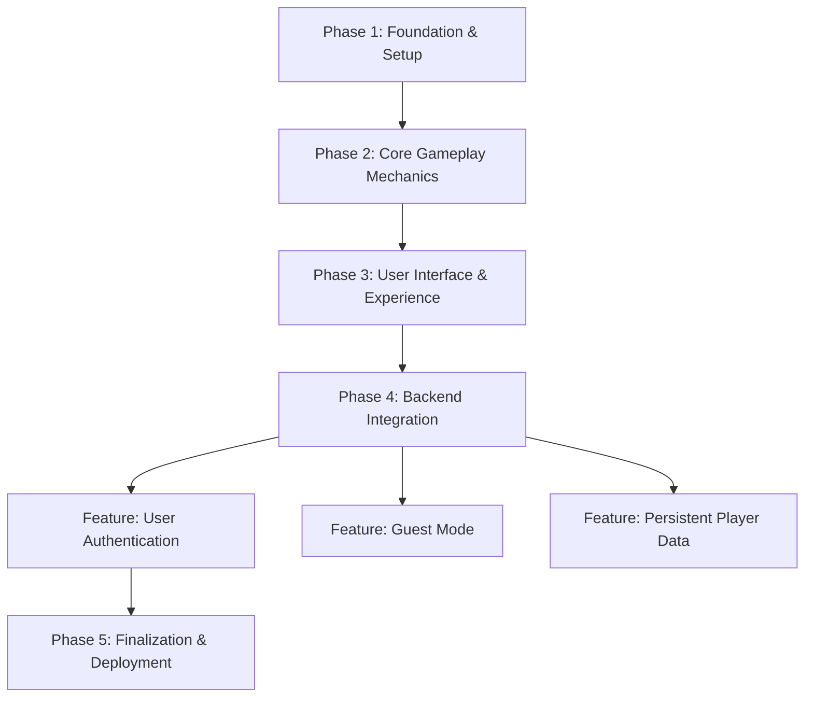

# Progress
This file tracks project progress using a detailed task list.
2025-07-01 10:02:07 PM (Australia/Brisbane, UTC+10:00) - Log of the latest update.

## Project Phases

## Completed Tasks

### Phase 5: UX/UI Enhancements
- [x] **Character Select Screen:** Add a welcome message: "Welcome [username], to proceed select your trading character."
- [x] **Character Select Screen:** Display character information/description when a character is hovered over or selected.
- [x] **Trading Screen:** Relocate the Sanity meter from the top-left header to the right-side trading panel, directly below the BPM meter.
- [ ] **Trading Screen:** Relocate the trader profile from the header to the trading panel. The new design should feature two boxes: a larger one for the character image and a smaller one for the character name, placed under the "TRADER STATUS" heading. (Complexity: 6/10)

### Phase 1: Foundation & Setup
- [x] Initialize project repository.
- [x] Set up the React + Vite frontend environment.
- [x] Configure Supabase backend project.
- [x] Establish basic file structure as per the GDD.

### Phase 2: Core Gameplay Mechanics
- [x] Implement the procedurally generated stock chart (`ChartDisplay`).
- [x] Develop core trading logic (Buy/Sell, Leverage, PNL, Liquidation).
- [x] Implement the game timer and game over conditions.

### Phase 3: User Interface & Experience
- [x] Build all UI components (`GameHeader`, `TradingPanel`, etc.) with a pixel art aesthetic.
- [x] Implement the full game flow from Start Screen to Game Over screen.
- [x] Develop the Emotional Feedback System (Sanity, Heart Rate, Emotion).
- [x] Add UI animations and audio feedback.

### Phase 4: Backend Integration
- [x] **Feature: User Authentication**
    - [x] **Backend Configuration & Cleanup**
        - [x] **Supabase Project Setup:**
            - [x] Enable Google as an authentication provider in the Supabase project dashboard.
            - [x] Add Google OAuth credentials (Client ID and Client Secret) to the Supabase configuration.
            - [x] Ensure the site URL and redirect URI are correctly configured in Supabase Auth settings.
            - [x] Confirm Email provider is enabled in Supabase dashboard.
        - [x] **Database & Function Cleanup:**
            - [x] **[DESTRUCTIVE]** Drop the `access_codes` table from the public schema.
            - [x] **[DESTRUCTIVE]** Delete the `verify-access-code` Edge Function from the Supabase project.
    - [x] **Frontend Implementation**
        - [x] **Component & State Management:**
            - [x] Update `Login.jsx` to include:
                - [x] Email and Password input fields.
                - [x] "Login", "Sign Up", and "Login with Google" buttons.
            - [x] Modify the main `App.jsx` to manage user authentication state (e.g., checking if a user is logged in).
            - [x] Create a `useAuth` hook or context to provide authentication state and functions to the component tree.
        - [x] **Authentication Flow:**
            - [x] Implement the `signInWithEmail` function.
            - [x] Implement the `signUpNewUser` function.
            - [x] Implement the `signInWithGoogle` function that calls Supabase's `signInWithOAuth` method.
            - [x] Implement a `signOut` function.
            - [x] Update `App.jsx` to show the `Login` component if the user is not authenticated, and the `CharacterSelect` screen if they are.
        - [x] **Component Cleanup:**
            - [x] **[DESTRUCTIVE]** Delete the `src/components/AccessCodeVerification.jsx` file.
            - [x] Remove any references to the old access code verification flow from `App.jsx`.
    - [x] **UX Flow Implementation**
        - [x] **Sign Up:**
            - [x] Upon successful signup, display the "Please check your email to verify" message.
        - [x] **Forgot Password:**
            - [x] Add the "Forgot Password?" link to the `Login` component.
            - [x] Implement the UI flow to capture the user's email.
            - [x] Integrate the call to Supabase's `resetPasswordForEmail` function.
            - [x] Display the confirmation message after the request is sent.
        - [x] **Logout:**
            - [x] Add a "Logout" button to the `GameHeader`.
            - [x] Wire the button to the `signOut` function.
    - [x] **Refined Error Handling**
        - [x] Implement a central error display mechanism (e.g., a toast or notification component).
        - [x] Map the specific technical errors from the `authentication_plan.md` to the correct user-friendly messages in the UI, paying special attention to the `User already registered` case.
        - [x] Ensure all authentication-related forms (`Login`, `Sign Up`, `Forgot Password`) display these messages correctly.
    - [x] **Remove Email/Password Authentication:**
        - [x] Remove the email/password form from the `Login` component.
        - [x] Ensure "Sign in with Google" is the only visible option.
        - [x] Remove the "Forgot Password?" link and its associated component/logic.
        - [x] Delete the `ForgotPassword.jsx` and `UpdatePassword.jsx` components.
        - [x] Clean up any related state and functions in `useAuth.js` and `AuthContext.jsx`.
    - [x] **Handle Existing Social Accounts**
        - [x] When a user signs in with Google, check if an account with that email already exists.
        - [x] If it does, inform the user and guide them to log in with their original method.
- [x] **Feature: Player Profiles**
    - [x] **Task 1: Design Database Schema (Complexity: 3/10)**
    - [x] **Task 2: Create Supabase Migration (Complexity: 4/10)**
    - [x] **Task 3: Automate Profile Creation (Complexity: 7/10)**
        - [x] Create a Supabase trigger and function to automatically insert a new row into `profiles` when a new user signs up.
        - [x] The function should extract the user's name from the Google OAuth data (`raw_user_meta_data`) and use it as their `username`.
    - [x] **Task 4: Frontend Profile Management (Complexity: 6/10)**
        - [x] Implement logic in the frontend to fetch the user's complete profile upon login.
        - [x] Create functions to update the `wallet_balance` in the database during gameplay.
- [x] **Feature: Guest Mode**
    - [x] **Task 1: Implement Guest Flow UI (Complexity: 4/10)**
        - [x] In `Login.jsx`, add a "Play as Guest" button.
        - [x] Display a warning message below the button: "Your progress will not be saved."
    - [x] **Task 2: Implement Guest State Management (Complexity: 5/10)**
        - [x] In `App.jsx` and relevant contexts, manage a "guest" user state.
        - [x] Allow users in the guest state to proceed to the game screens without authentication.
- [x] **Miscellaneous**
    - [x] The user authentication and onboarding feature, including all UX refinements, is complete and ready for final review.
    - [x] Update the GameDesignDocument.md to reflect the current implementation.
    - [x] Fix application crash by removing dead imports from App.jsx.
    - [x] Task 5: Improve Login UX for Existing Social Accounts.

- [x] **Feature: Persistent Player Data**
    - [x] **Task 5: Integrate Profile Data into Gameplay (Complexity: 6/10)**
        - [x] When a logged-in user starts a game, initialize their wallet balance from their profile.
        - [x] At the end of a game session, save the updated wallet balance to their profile.
        - [x] Display the user's `username` in the `GameHeader` component.

## Current Tasks
- [x] **Trading Screen:** Relocate the timer from the header to the bottom-right corner of the chart display area and reduce its size.
- [ ] **Bug Fix:** Correct the OAuth redirect flow for the production environment.
- **Complexity:** 3/10
- **Description:** Update the Supabase authentication settings to include 'https://play.sbpgame.com' as an authorized redirect URI.

## Next Steps
- [ ] *(No tasks currently planned)*

### Phase 5: UX/UI Enhancements
- [x] **Login Screen:** Add `sbp.gif` as the background.
- [x] **Login Screen:** Add prominent welcome text: "Welcome to Stop Being Poor: The Trading Game".

## Learning Logs
- A generic error on failed password login is a security feature from Supabase to prevent user enumeration. To provide a better UX for social-login users, a backend function is required to check the user's provider.
- A critical bug was found where a user's wallet balance would reset on 'Play Again'. The root cause was stale client-side state. The fix involved ensuring that after a database update (e.g., saving the wallet balance), the local state in the React Context is immediately updated to match. This prevents components from using outdated data and makes the local context a reliable source of truth, simplifying state management across the app.