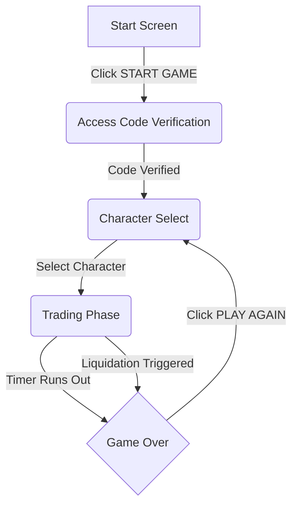

# Game Design Document: Stop Being Poor

**Last Updated:** 2025-04-30

## 1. Introduction

*   **Game Title:** Stop Being Poor
*   **Concept:** A fast-paced, high-stakes trading simulation game with emotional feedback mechanics, challenging players to manage risk and emotion under pressure within a retro pixel art aesthetic.
*   **Genre:** Simulation, Arcade Trading
*   **Target Audience:** Casual gamers interested in trading concepts, players enjoying high-risk/reward mechanics, fans of retro aesthetics.
*   **Theme:** Retro pixel art, high-energy, slightly stressful trading environment with a neon green and black color palette.

## 2. Gameplay

*   **Core Loop:**
    1.  **Start Screen:** Player initiates the game.
    2.  **Access Code Verification:** Player enters and verifies an access code to gain entry.
    3.  **Character Selection:** Player chooses a trader persona, influencing gameplay elements like Sanity drain.
    4.  **Trading Phase:** Player actively manages trades within a time limit, reacting to simulated price changes and managing leverage.
    5.  **Game Over Screen:** Game ends due to the timer expiring or the player being liquidated. Final results and trade history are displayed.
    6.  **Restart:** Player can choose to play again from the Game Over screen, returning to Character Selection.

*   **Mechanics:**
    *   **Trading:**
        *   Players can open a single position at a time (either BUY/LONG or SELL/SHORT) by clicking the respective buttons.
        *   The `entryPrice` is recorded at the exact market price when the position is opened.
    *   **Leverage:**
        *   A `leverage` multiplier (ranging from 1x to 1000x) is selected using a slider *before* opening a position.
        *   Leverage amplifies both potential profits and losses relative to the position size.
        *   The selected leverage is locked and cannot be adjusted while a position is open.
    *   **Position Size & Margin:**
        *   The entire current `walletBalance` is automatically allocated and used as the `initialMargin` for the trade when a position is opened.
    *   **PNL (Profit and Loss):**
        *   Calculated and displayed in real-time for the open position.
        *   The calculation is based on the point difference between the `currentPrice` and the `entryPrice`, scaled by a fixed value per point ($10), and then multiplied by the selected `leverage`.
        *   Formula (for LONG): `PNL = (Current Price - Entry Price) * $10 * Leverage`
        *   Formula (for SHORT): `PNL = -(Current Price - Entry Price) * $10 * Leverage`
        *   The real-time `PNL` directly affects the displayed `walletBalance` while a position is open (`Displayed Wallet Balance = Initial Wallet Balance (Margin) + Current PNL`).
    *   **Wallet Balance:**
        *   Starts at an initial value of $10,000.
        *   Fluctuates in real-time based on the `Current PNL` of an open position.
        *   When a position is closed (either manually or via liquidation), the final `PNL` is realized and permanently added to or subtracted from the `walletBalance`.
    *   **Liquidation:**
        *   Liquidation is triggered automatically when the negative `PNL` of an open position becomes equal to or exceeds the `initialMargin` (the `walletBalance` at the time the position was opened).
        *   Upon liquidation, the open position is forcibly closed, the player loses the entire `initialMargin`, the `walletBalance` is set to $0, and the game ends immediately.
        *   A `liquidationPrice` is calculated when a position is opened, representing the market price point at which liquidation will occur.
    *   **Sanity Meter:**
        *   A visual meter (represented as X/8 points) indicating the trader's mental state and risk tolerance.
        *   Sanity decreases when opening a position, with the amount of decrease influenced by the selected character's persona.
        *   Sanity also decreases during periods of significant negative PNL.
        *   Reaching 0 sanity triggers an immediate game over, regardless of the timer.
    *   **Heart Rate (BPM):**
        *   A visual indicator reflecting the trader's stress and excitement levels.
        *   Heart rate increases when opening positions and during significant PNL swings (both positive and negative).
        *   Higher leverage also contributes to a higher heart rate.
        *   The heart rate is displayed with an animated ECG line whose speed dynamically changes with the BPM value.
    *   **Game Timer:**
        *   The trading phase has a fixed duration of 120 seconds (2 minutes).
        *   A countdown timer is displayed during the trading phase.
        *   When the timer reaches zero, the game ends. Any open position is automatically closed at the current market price, and the final results are displayed on the Game Over screen.

*   **Controls:**
    *   **Buttons:** Used for initiating game flow ("START GAME", "PLAY AGAIN"), character selection, and executing trading actions ("BUY/LONG", "SELL/SHORT", "CLOSE"). Trading action buttons have disabled states based on the current position.
    *   **Slider:** Used to adjust the `leverage` multiplier before opening a position. It is disabled while a position is open.
    *   **Chart Interaction:** Includes mouse wheel functionality for scrolling through historical chart data, mouse drag (specifically right-click drag is planned) for panning the visible chart area, and dedicated buttons for zooming in/out and navigating to the past/present ends of the chart.

## 3. Game Flow

The game progresses through distinct phases, guided by user interaction and game events. The primary flow is as follows:

1.  **Start Screen:** The initial entry point where the player is greeted with the game title and a prompt to begin.
2.  **Access Code Verification:** Before accessing the main game, the player must successfully enter and verify a valid access code.
3.  **Character Select:** The player chooses one of the available trader personas, each potentially influencing gameplay elements like Sanity drain.
4.  **Trading Phase:** The core gameplay loop where the player interacts with the trading chart, manages leverage, opens and closes positions, and reacts to market fluctuations. This phase is time-limited to 120 seconds.
5.  **Game Over:** The game concludes either when the timer expires or if the player's position is liquidated. The final wallet balance, total PNL, and trade history are presented.
6.  **Restart:** From the Game Over screen, the player has the option to return to the Character Select screen to begin a new game with a fresh wallet balance.

## 4. User Interface (UI)

The user interface adopts a consistent retro pixel art aesthetic, utilizing the 'Press Start 2P' and 'VT323' fonts and a limited color palette dominated by black and neon green (`#00ff00`). UI elements feature distinct pixelated borders and subtle background patterns. The overall game view is designed to be scaled to fit the player's viewport, likely handled by the `GameViewportScaler` component.

*   **Start Screen:**
    *   A minimalist screen featuring the prominent game title "STOP BEING POOR".
    *   A large, pixel-styled "START GAME" button to initiate the game flow.

*   **Access Code Verification Screen (`AccessCodeVerification.jsx`):**
    *   Displayed before the main game content.
    *   Features a pixel-styled container with a "Enter Access Code" header.
    *   An input field for the user to enter the access code.
    *   A "Verify Code" button to submit the code.
    *   Displays messages indicating verification status (success or error).

*   **Character Select Screen (`CharacterSelect.jsx`):**
    *   Presented after successful access code verification.
    *   Displays the title "SELECT YOUR TRADER".
    *   Presents the available trader characters (Stoic 😐, Nervous Newbie 😰, Full Degen 🤪) in a grid layout.
    *   Each character is represented by a pixel-styled button showing their emoji and name. Clicking a button selects the character and proceeds to the trading phase.

*   **Trading Screen (Main Gameplay - Managed by `InteractiveTradingPreview.jsx`):**
    *   The primary game view, divided into several key areas:
        *   **Game Header (`GameHeader.jsx` - Top):**
            *   Displays the selected character's emoji and name.
            *   Shows the current Wallet Balance and Total Session PNL (color-coded for positive/negative).
            *   Features a prominent countdown Timer for the trading session.
            *   Includes the visual Sanity Meter (🧠 icon, current/max value, segmented bar with color changes based on level).
        *   **Chart Display (`ChartDisplay.jsx` - Main Area):**
            *   Renders the simulated stock price chart using SVG, displaying candlestick data.
            *   Includes a Price/Position Info Bar above the chart showing the Current Price.
            *   When a position is open, this bar expands to show detailed position information: Type (LONG/SHORT), Entry Price, Position Size (Initial Wallet), Leverage (@X), Margin (Initial Wallet), Real-time PNL (color-coded), and Liquidation Price (in red).
            *   Visualizes the Entry Price (dashed green/red line) and Liquidation Price (dashed red line) directly on the chart when a position is active.
            *   Provides chart navigation (scroll, pan) and zoom controls (+/- buttons).
        *   **Trading Panel (`TradingPanel.jsx` - Side Area):**
            *   Contains "TRADING SETTINGS" including a non-editable display of the current Position Size (reflecting the current wallet balance).
            *   Features the interactive Leverage slider (1x-1000x range), which is disabled when a position is open. The slider visually indicates high leverage warnings.
            *   Includes "TRADER STATUS" displaying the animated Heart Rate Monitor (BPM value, animated ECG line) and the dynamic Trader Emotion Emoji display within a bordered box.
        *   **Trading Actions (`TradingActions.jsx` - Bottom):**
            *   Displays a summary bar showing the current Leverage setting, the number of Trades taken, and the Total Session PNL.
            *   Provides the core action buttons: "BUY/LONG" (green), "SELL/SHORT" (red), and "CLOSE" (grey/white).
            *   Button states are appropriately disabled based on whether a position is open and the current position type.

*   **Game Over Screen (`GameOver.jsx`):**
    *   Displayed when the game ends (timer expires or liquidation occurs).
    *   Features a large title indicating the game over condition ("LIQUIDATED!" in red or "TIME'S UP!").
    *   Shows the Final Wallet Balance and Total Session PNL.
    *   If liquidated, a specific details box is displayed showing the liquidated position's Type, Entry Price, Liquidation Price, and Leverage.
    *   Includes a scrollable Trade History table listing the Type and PNL for each completed trade.
    *   Provides a "PLAY AGAIN" button to reset the game and return to the Character Select screen.

*   **Animation Overlays (`AnimationOverlays.jsx`):**
    *   Provides non-intrusive visual feedback overlays that appear briefly over the main game content.
    *   Includes a brief green screen flash for profit.
    *   Includes a brief red screen flash and subtle shake for loss.
    *   Includes a more intense screen shake, red flash, and animated "LIQUIDATED!" text overlay upon liquidation.

## 5. Art & Audio

*   **Visuals:** Consistent retro pixel art style applied throughout the UI. Neon green (`#00ff00`) serves as the primary accent color against black backgrounds. Red (`#ff3333`) is used to indicate negative PNL, short positions, and warnings. Yellow/Orange colors are used for intermediate warning states (e.g., Sanity level). Key UI elements like buttons and containers feature a distinct "pixelated" border style. The game utilizes the 'Press Start 2P' and 'VT323' bitmap fonts for text. Animations include the animated ECG line in the Heart Rate Monitor, dynamic changes and animations (pulse, shake) for the trader emotion emoji, and screen flashes/shakes for significant game events like profit, loss, and liquidation.
*   **Audio (Suggestions - Not Implemented):**
    *   **UI Sounds:** Distinct sound effects for button clicks, slider adjustments, and other interactive UI elements.
    *   **Game Events:** Specific audio cues for opening a trade, closing a trade (with different sounds for profitable vs. losing trades), a dramatic alarm or sound effect upon liquidation, a timer tick-tock (potentially increasing in intensity as the time limit approaches), and a game over stinger.
    *   **Ambiance:** A low, unobtrusive retro electronic background music loop could play during the trading phase to enhance the atmosphere.

## 6. Technical

*   **Frontend Framework:** React (`react`, `react-dom`) is used for building the single-page application user interface.
*   **Build Tool:** Vite is used as the build tool, providing a fast development server and efficient build process.
*   **Styling:** The application uses a combination of Tailwind CSS for layout and utility classes, and custom CSS (defined in `App.css`, `index.css`, and inline styles within components) for specific pixel art styling, animations (`@keyframes`), and detailed visual elements.
*   **Language:** The frontend is primarily written in JavaScript (ES6+) with JSX for defining UI structures. TypeScript is also present in the project (`supabase/functions/verify-access-code/index.js` uses `.js` but the import map suggests TypeScript usage), indicating potential for wider adoption.
*   **State Management:** Primarily handled using React's built-in `useState` and `useEffect` hooks within the main `InteractiveTradingPreview` component. State and handler functions are passed down to child components via props.
*   **Backend Services:** Supabase is utilized for backend services, including:
    *   **Supabase Auth:** For managing user authentication and sessions.
    *   **Supabase Database (PostgreSQL):** For data persistence, likely storing user profiles, portfolios, and trade history. Row Level Security (RLS) is the intended method for database access control.
    *   **Supabase Edge Functions:** Deno-based serverless functions used for specific backend logic, such as the `verify-access-code` function.
*   **API Interaction:** Interaction with the Supabase backend occurs primarily through the official `@supabase/supabase-js` client library for database and authentication operations, and explicit HTTP calls to Supabase Edge Functions.
*   **Environment Configuration:** Supabase URL and anonymous key are configured using environment variables, typically loaded from a `.env` file in development and managed by the hosting environment in production.
*   **Chart Implementation:** The trading chart is rendered using Scalable Vector Graphics (SVG), allowing for dynamic drawing and manipulation of chart elements like candlesticks and lines. Custom CSS is used to style the SVG elements to match the pixel art theme.
*   **Dependencies:** Key dependencies include `@supabase/supabase-js`, `react`, `react-dom`, `tailwindcss`, and `vite`. The presence of `firebase` in `package.json` is noted but its current use in the project is not evident from the examined files.